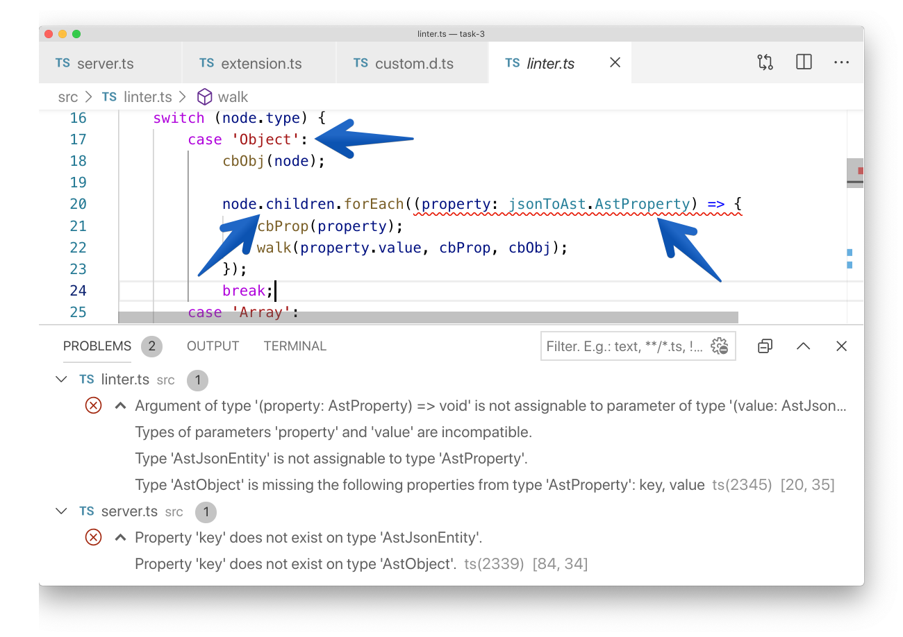
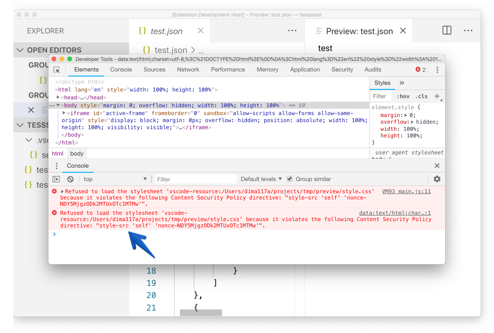
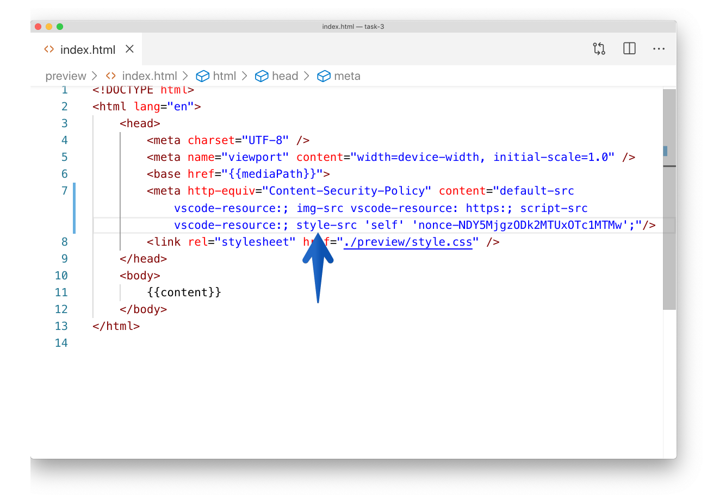

---

layout: yandex2

style: |
    /* собственные стили можно писать здесь!! */
    
    .xxx {background-color: #999;}
    .xxx img {height: 1120px;margin: 0 auto;}
    .slide.blockquote.yyy h2 {font-size: 95px;}
    .slide.blockquote.yyy>div {right:100px;}

---

# {:.logo}

## {{ site.presentation.title }}
{:.title}

### {{ site.presentation.service }}



{:.nda}




{{ site.author.name }}, {{ site.author.position }}





{{ site.author2.name }}, {{ site.author2.position }}



## Разобраться в чужом коде и в незнакомом API
{:.blockquote}

## Что нужно сделать
{:.fullscreen .xxx}

## Что в репозитории

- {:.next}[TypeScript](https://www.typescriptlang.org/docs/home.html)
- {:.next}[json-to-ast](https://www.npmjs.com/package/json-to-ast)
- {:.next}точка входа — extension.ts
- {:.next}настройки — package.json

## [Webview API](https://code.visualstudio.com/api/extension-guides/webview)  [Language Server](https://code.visualstudio.com/api/language-extensions/language-server-extension-guide)
{:.shout}

## Пробуем запустить
{:.section}

## Сообщения об ошибках
{:.fullscreen .xxx}

## Cannot find module 'out/extension.js'.
{:.blockquote}

## Ошибка в тайпингах
{:.fullscreen .xxx}

## Ошибка в тайпингах
{:.fullscreen .xxx}

## Menu item references a command 'example.showPreviewToSide' which is not defined in the 'commands' section.
{:.blockquote .yyy}

## Неправильное название команды
{:.fullscreen .xxx}

## Запустилось!
{:.fullscreen .xxx}

## Чиним превью
{:.section}

## Ошибка в CSP
{:.fullscreen .xxx}

## Ошибка в CSP
{:.fullscreen .xxx}

## [Content Security Policy](https://developer.mozilla.org/ru/docs/Web/HTTP/CSP)
{:.shout}

## Ошибка в CSP
{:.fullscreen .xxx}

## Неправильный путь
{:.fullscreen .xxx}

## Неправильный путь
{:.fullscreen .xxx}

## Неправильный путь
{:.fullscreen .xxx}

## Ошибка в стилях
{:.fullscreen .xxx}

## Ошибка в стилях
{:.fullscreen .xxx}

## Ошибка в стилях
{:.fullscreen .xxx}

## Превью открывается два раза
{:.fullscreen .xxx}

## Превью открывается два раза
{:.fullscreen .xxx}

## Превью открывается два раза
{:.fullscreen .xxx}

## Превью работает, линтер не работает
{:.fullscreen .xxx}

## Чиним линтер
{:.section}

## Как запускается линтер
{:.fullscreen .xxx}

## DEMO: Debugging Language Server
{:.shout}

## Пустой список ошибок
{:.fullscreen .xxx}

## Пустой список ошибок
{:.fullscreen .xxx}

## Другие критерии
{:.section}

## Удалить лишнее

Неиспользуемые файлы:
    
- jsonMain.ts
- hash.ts

&nbsp;

Лишние зависимости:
    
- request-light
- vscode-nls

## Обоснованные решения

- описан ход мыслей
- атомарные коммиты, понятные сообщения

## Линтер из второго задания

- починить тестовый линтер
- подключить линтер из второго задания в отдельной ветке

## Спасибо! 
{:.contacts}



<figure markdown="1">

### {{ site.author.name }}


{{ site.author.position }}


</figure>





<figure markdown="1">

### {{ site.author2.name }}


{{ site.author2.position }}


</figure>



<!-- разделитель контактов -->
-------

<!-- left -->
- {:.skype}dima117a
- {:.telegram}dima117a

<!-- right -->
- {:.mail}dima117a@yandex-team.ru
- {:.github}dima117

<!-- 

- {:.mail}author@yandex-team.ru
- {:.phone}+7-999-888-7766
- {:.github}author
- {:.bitbucket}author
- {:.twitter}@author
- {:.telegram}author
- {:.skype}author
- {:.instagram}author
- {:.facebook}author
- {:.vk}@author
- {:.ok}@author

-->
